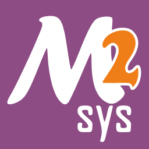

<header>
<h1 style="text-align: center; margin: 3% 0 3% 0">
    
    
</h1>
</header>

# 

Mingw-w64 is a collection of header files, import libraries, libraries and tools
that, when combined with a compiler toolchain, such as GCC or LLVM, provides a
complete development environment for building native Windows applications and
libraries.

Mingw-w64 is an advancement of the original mingw.org project, which was created
to support the GCC compiler on Windows systems. It was forked in 2007 in order
to provide 64-bit support and newer APIs. It has since then gained wide use and
distribution.

**Headers and Libraries:**

- More than a million lines of headers are provided, not counting generated ones,
  and regularly expanded to track new Windows APIs.
- Everything needed for linking and running your code on Windows.
- Better-conforming and faster math support compared to VisualStudio's.

**Runtime Libraries:**

- Winpthreads, a pthreads library for C++11 threading support and simple
  integration with existing project.
- Winstorecompat, a work-in-progress convenience library that eases conformance
  with the Windows Store.

**Tools:**

- gendef: generate Visual Studio .def files from .dll files.
- genidl: generate .idl files from .dll files.
- widl: compile .idl files.

## Project Collaborations

Mingw-w64 interacts a lot with other projects in order to help everyone move
forward. Contributions have been going to and coming from these projects:

<table>
<tr>
<td style="text-align: center">
    <a href="https://cygwin.com" class="media" title="https://cygwin.com">
     Cygwin
    </a>
</td>
<td style="text-align: center">
    <a href="https://reactos.org/" class="media" title="https://reactos.org/">
     
    ReactOS
    </a>
</td>
<td style="text-align: center">
    <a href="https://winehq.org" class="media" title="https://winehq.org">
     
    Wine
    </a>
</td>
<td style="text-align: center">
    <a href="https://www.msys2.org" class="media" title="https://www.msys2.org">
     
    MSYS2
    </a>
</td>
</tr>
</table>

## Projects using mingw-w64

- [Fedora cross-compiler](https://fedoraproject.org/wiki/MinGW)
- [Npackd](https://npackd.appspot.com)
- [OpenSUSE](https://opensuse.org)
- [Win-builds](https://win-builds.org)
- [Barchart-UDT](https://code.google.com/p/barchart-udt/)
- [Blender](https://www.blender.org/)
- [Boost](https://www.boost.org/)
- [Botan](https://botan.randombit.net/)
- [Code::Blocks](https://www.codeblocks.org/)
- [DAE Tools](https://daetools.sourceforge.net)
- [devkitPro](https://devkitpro.org/)
- [Disk Based HashTables](https://sourceforge.net/projects/dbh/)
- [Ecere SDK](https://www.ecere.org/)
- [Ekiga](https://www.ekiga.org/)
- [Emerge Desktop](https://emergedesktop.org)
- [Enlightenment](https://www.enlightenment.org/)
- [Factor](https://factorcode.org/)
- [FFmpeg](https://ffmpeg.mplayerhq.hu/)
- [FLTK](https://www.fltk.org/)
- [Freecell Solver](https://fc-solve.shlomifish.org/)
- [Freeverb3](https://freeverb3.sourceforge.net/)
- [GCC: The GNU Compiler Collection](https://gcc.gnu.org/)
- [GDB: The GNU Project Debugger](https://www.gnu.org/software/gdb/)
- [GIMP](https://www.gimp.org)
- [GNU Binutils](https://www.gnu.org/software/binutils/)
- [GNU SASL](https://www.gnu.org/software/gsasl/)
- [GnuTLS](https://www.gnu.org/software/gnutls/)
- [GraphicsMagick](http://www.graphicsmagick.org/)
- [GTK+](https://www.gtk.org/docs/installations/windows)
- [Hexen II: Hammer of Thyrion](https://uhexen2.sf.net/)
- [ImageMagick](https://www.imagemagick.org/)
- [JPen](https://jpen.sf.net/)
- [Kotlin](https://kotlinlang.org)
- [KDE Software Collection](https://kde.org/)
- [LibreOffice](https://www.libreoffice.org/)
- [libsndfile](http://www.mega-nerd.com/libsndfile/)
- [libvirt](https://libvirt.org/)
- [libvpx](https://www.webmproject.org/)
- [Libxml2](https://gitlab.gnome.org/GNOME/libxml2/-/wikis/home)
- [MAME (Yes, the arcade emulator!)](https://mamedev.org/)
- [ManKai Common Lisp](https://common-lisp.net/project/mkcl/)
- [mpg123](https://www.mpg123.de/)
- [MS MPI](https://www.symscape.com/configure-msmpi-for-mingw-w64)
- [OCaml](https://www.ocaml.org)
- [OpenFOAM](https://www.symscape.com/openfoam-1-7-x-on-windows-64-mpi)
- [OpenLisp](https://www.eligis.com/)
- [OpenSSL](https://www.openssl.org/)
- [OpenTURNS](https://openturns.github.io/www/)
- [Perl (5.12.0 and later)](https://www.perl.org/)
- [PostgreSQL](https://www.postgresql.org/)
- [pthreads](https://sourceware.org/pthreads-win32/)
- [PToolsWin](https://www.paratools.com/PToolsWIN)
- [QEMU](https://qemu.org)
- [Qt](https://qt-project.org/)
- [QuakeSpasm](https://quakespasm.sourceforge.net/)
- [ReMooD](https://remood.sf.net/)
- [Smart Image Denoiser](http://smartimagedenoiser.com/)
- [smartmontools](https://smartmontools.sourceforge.net/)
- [Strawberry Perl (bundles C toolchains)](https://strawberryperl.com/)
- [strongSwan](https://strongswan.org/)
- [The R Project for Statistical Computing](https://www.r-project.org/)
- [VideoLAN VLC](https://www.videolan.org/vlc/)
- [VSXu](https://www.vsxu.com/)
- [Woo](https://www.woodem.eu/)
- [wxWidgets](https://www.wxwidgets.org/)
- [YafaRay](https://www.yafaray.org/)
- [zlib](https://www.zlib.net/)

*Feel free to add your project to this list!*
